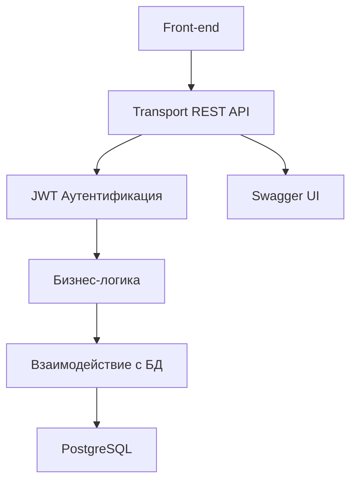
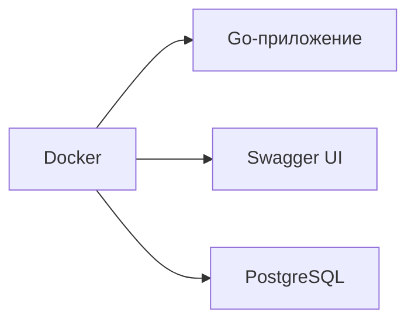
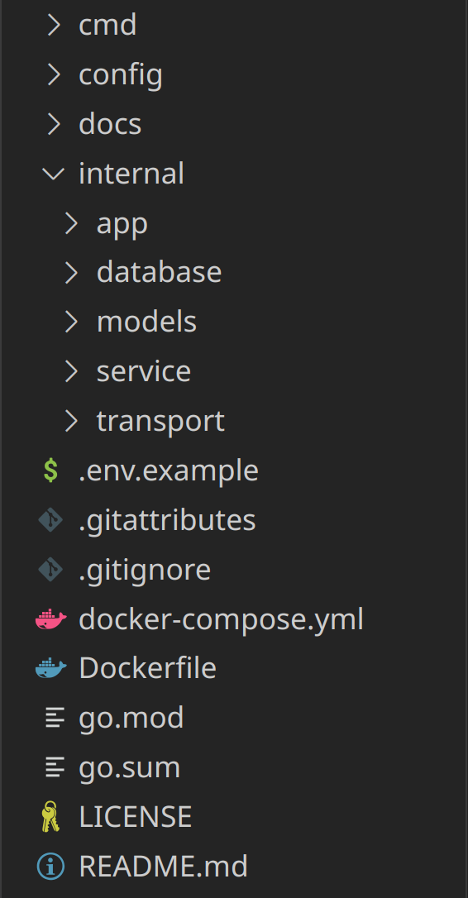
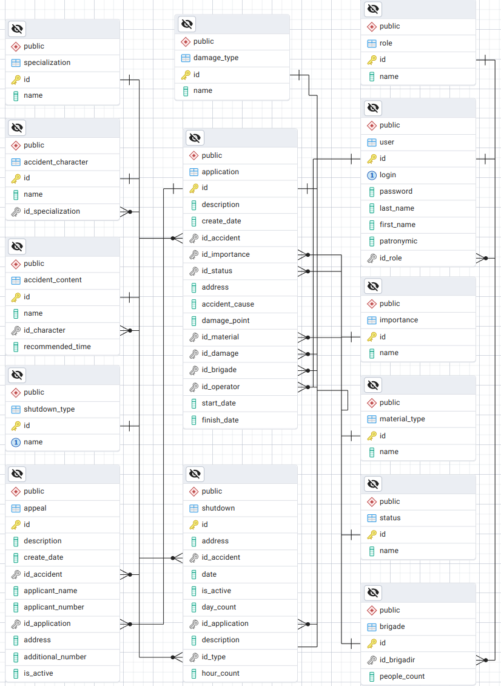

# system of crush
## О проекте
REST API для эффективной работы аварийных служб в сфере водоснабжения и водоотведения.

Оператор в веб-клиенте оформляет обращения жителей и создаёт заявки на ремонт, указывая необходимость отключения воды и все данные для устранения аварии.

Бригадиры в мобильном приложении выбирают задачи, видят адреса и точные данные о материалах. Они фиксируют начало и завершение работ. После выполнения заявок оператор просматривает общую статистику по работе бригад и устраненным авариям.

Администратор управляет сотрудниками и их ролями в системе.
## Функционал
Основные функции веб-приложения:
- Сбор обращений от населения.
- Составление заявок на ремонт аварии.
- Фиксация отключения воды.
- Просмотр подробной статистики о работе бригад и оператора.
- Управление пользователями системы.

Основные функции мобильного приложения:
- Выбор заявок на ремонт.
- Просмотр необходимых для работ данных.
- Фиксация начала и завершения работ.

 Технический функционал(для фронтенда):
 - Swagger документация по всем эндпоинтам и моделям
 - Возращение статус-кодов(200, 201, 404, 401, 500)
 - JWT Аутентификация
## Технологии
Список технологий используемых в проекте
- Язык программирования: [Go](https://go.dev/)
- Маршрутизация: [Gin](https://github.com/gin-gonic/gin)
- Логгирование: [log](https://pkg.go.dev/log)
- Взаимодействие с БД: [pgxpool](https://pkg.go.dev/github.com/jackc/pgx/v4/pgxpool)
- Хэширование паролей: [bcrypt](https://pkg.go.dev/golang.org/x/crypto/bcrypt)
- JWT: [jwt](https://github.com/golang-jwt/jwt)
- База данных: [PostgreSQL](https://www.postgresql.org/)
- Документация: [Swagger](https://swagger.io/)
- Контейнеризация: [Docker](https://www.docker.com)
## Архитектура
### Основная логика

### Инфраструктура

### Структура проекта

### База данных

## Установка и запуск
### 1. Клонировать репозиторий
```bash
git clone https://github.com/Flectere/system_of_crush
cd system_of_crush
```
### 2. Настройка .env и конфига
- Создайте `.env` файл в корне проекта по шаблону `.env.example`
- Измените параметры `local_config.json`(**опционально**)
### 3. Запуск через docker-compose
```bash
docker compose up
```
## Использование
### Swagger
 Для того чтобы перейти на веб-страницу с документацией введите в адресной строке: `http://localhost:8080/docs`. Там вы сможете просмотреть все эндпоинты, модели запросов и ответов, а так же протестировать работу запросов. 
### Примеры эндпоинтов
- **GET /appeals** — получить список обращений.
- **POST /appeals** — создать новое обращение.
- **GET /mobile/application/brigadir/{id_brigadir}** — список присвоенных заявок для бригадира.
- **PATCH /mobile/{id}/start-application** — зафиксировать начало работы.
- **GET /statistics/brigades** — получить статистику по работе бригад.
### Аутентификация
- Вход через эндпоинт `POST /auth/login`
- JWT токен передаётся в заголовке `Authorization: Bearer <token>`
### Роли
- **Оператор** — веб-клиент, создание заявок и просмотр статистики
- **Бригадир** — мобильное приложение, выбор и выполнение задач
- **Администратор** — веб-клиент, управление сотрудниками и ролями